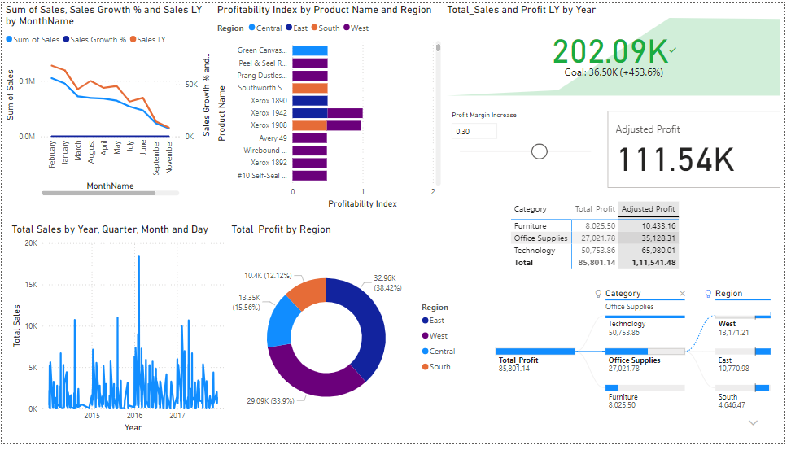
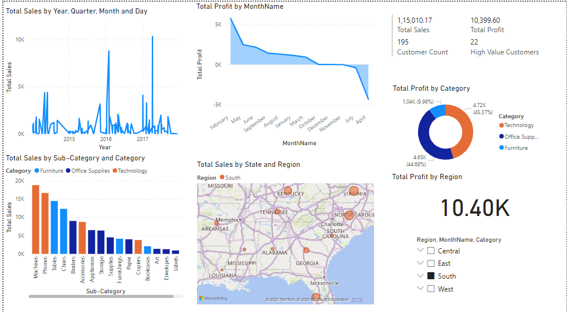

# 📊 E-commerce Sales & Profit Analysis Dashboard (Microsoft Power BI)

## 🧠 Project Overview

This project presents an advanced **Power BI dashboard** for analyzing e-commerce sales and profit performance. It incorporates rich, interactive visualizations and **dynamic insights** using **DAX**, **Power Query**, and **What-If analysis** to simulate real-world business scenarios like profit margin adjustments.

> 🔥 Built as a **capstone project** to showcase end-to-end data analytics and business intelligence skills.

---

## 📁 Dataset

- Source: Sample e-commerce transactional data
- Columns include:
  - `Order Date`, `Sales`, `Profit`, `Product Name`, `Category`, `Region`, `Customer Name`, etc.

---

## 🚀 Key Features

| Feature | Description |
|--------|-------------|
| 📈 **Sales & Profit Trends** | Yearly, Monthly, and LY (Last Year) comparison using line charts |
| 📊 **Profitability Index** | Product-level profit efficiency: `Profit / Sales` |
| 🎯 **What-If Analysis** | Interactive slider to simulate profit margin increases |
| 💰 **Adjusted Profit KPI** | Custom DAX measure dynamically updates with margin changes |
| 🌐 **Regional Performance** | Donut chart and matrix by region and category |
| 🧩 **Decomposition Tree** | Drill-down view from Total Profit to Category → Region |
| 📆 **Multi-Level Date Analysis** | Date breakdown by Year, Quarter, Month, and Day |

---

## 📌 Tools & Skills Used

- **Power BI Desktop**
- **Power Query** for data cleaning and transformation
- **DAX** for calculated measures & dynamic metrics
- **What-If Parameters** for interactive simulation
- **Card, Bar, Line, Matrix, Donut, Decomposition Tree visuals**
- **Business storytelling with data**

---

## 📷 Screenshots

### 🔹 Base Dashboard (Trend, Regional, Category Analysis)

### 🔹 Advanced Dashboard (What-If Parameter, Adjusted Profit, Matrix Comparison)

---

## 📌 Insights Generated

- 📉 Sales declined in Q2 across all regions — primarily in Technology and Office Supplies
- 💸 Profitability is highest in Central and East regions
- 📈 Simulating a +30% profit margin results in a projected profit of **₹111K**, up from ₹85K
- 📦 Certain products are selling well but have poor profitability → Candidates for removal or repricing

---

## 🧑‍💼 Ideal For

- **Data Analyst Resume Projects**
- **Business Intelligence Portfolio**
- **Data-Driven Decision Demonstration**

---

## 🏁 Next Steps (Optional Enhancements)

- RFM Customer Segmentation
- Tooltips with deep drillthrough pages
- Publish to Power BI Service with automated refresh
- Create mobile layout view
